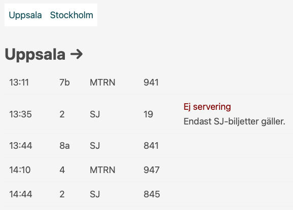

Pendlarn
========

Pendlarn is a little web app that shows the upcoming departures for trains
between Uppsala and Stockholm.



It was inspired by https://github.com/jesperorb/sthlm-uppsala but I wanted
something even simpler for my old phone.

Building
========

You can build the binary directly:

```
go build
```

or build a container image:

```
podman build . -t pendlarn
```

Running
=======

Firstly, you will of course need a server to run this on. Use your homelab or
favorite VPS provider.

There are two values you can configure:
* `TRAFIKVERKET_API_KEY` - API key to use for talking to https://api.trafikinfo.trafikverket.se
* `PORT` - the port for the HTTP server (default 3000)

If you just built the binary:

```
TRAFIKVERKET_API_KEY=topsecret ./pendlarn
```

if you built the container image:

```
podman run -it -e TRAFIKVERKET_API_KEY=topsecret -p3000:3000 pendlarn
```

Open http://localhost:3000 in your browser to see the UI.

That's all Folks.
